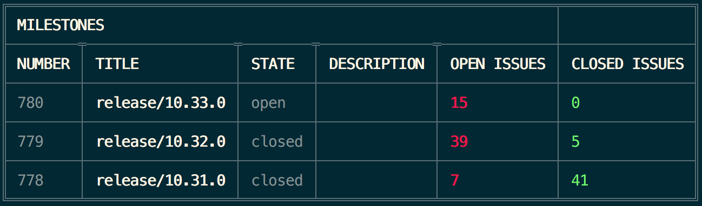

# cli-retrospective

[](https://badge.fury.io/js/cli-retrospective)
[](https://travis-ci.org/ilbonzo/cli-retrospective)
[](https://coveralls.io/github/ilbonzo/cli-retrospective?branch=master)
[](https://david-dm.org/ilbonzo/cli-retrospective)

### A cli tools for restropective

```cli-retrospective``` is a simple command line tools to see the issues related to a certain milestone when you have to do retrospective.



### Install

```cli-retrospective``` is available on ```npm``` and as such, can be installed through ```npm``` with ease.

To install ```cli-retrospective```, use the following command:

```sh
$ npm install -g cli-retrospective
```

_To configure your access informations run this command and answer the questions:_

```sh
$ cli-retrospective setup
```

### Usage

_view help_
```sh
$ cli-retrospective --help
```

_view subcommand help_
```sh
$ cli-retrospective [subcommand] --help
```

_list of all milestone_
```sh
$ cli-retrospective ls-milestone
```

_view milestone_
```sh
$ cli-retrospective milestone [number]
```
### Running the Tests

```sh
$ npm run test
```
### Issues

Please raise an issue on GitHub with as much information as possible and the steps to replicate (if possible).

## LICENSE

MIT license. See the LICENSE file for details.

---
Fork me on [github](https://github.com/ilbonzo/cli-retrospective)

Created by [@ilbonzo](https://twitter.com/ilbonzo)
